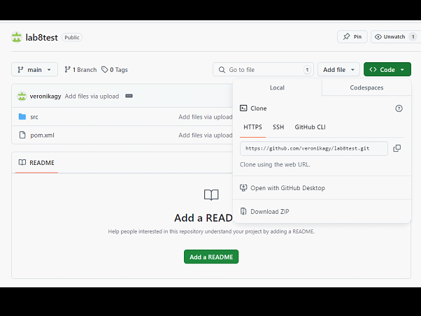
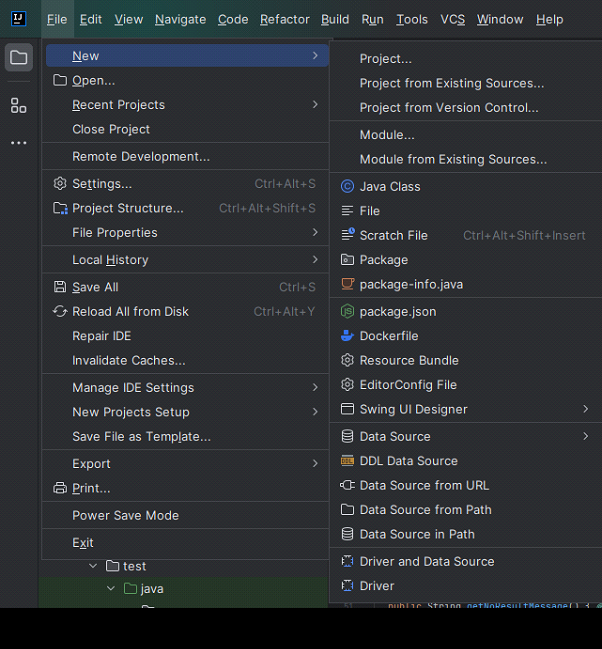
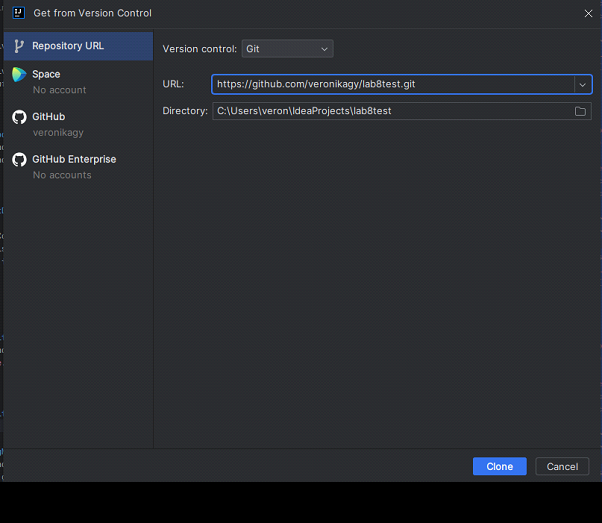
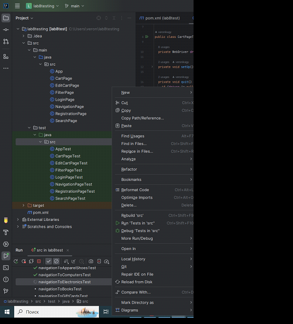

Нажмем на зеленую кнопку <>Code и скопируем url:

Откроем IntellijIdea -> File -> New -> Project from Version Control

Вставим скопированный URL:

Нажмём кнопку Clone. 
Важно: проект поддерживает версию java 17. 
Проект успешно собрался(ветка main). 
Можем запустить тесты: Нажмем пкм по папке test.java.src и выберем Run “Tests in ‘src’”

